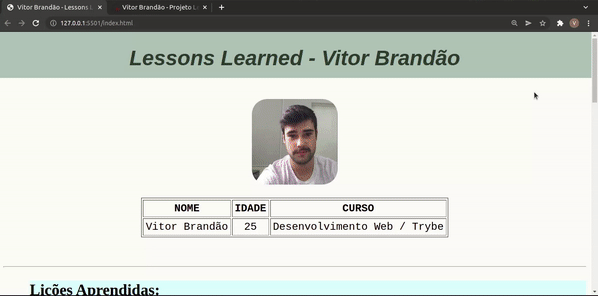

'Lessons Learned' foi o primeiro projeto desenvolvido em meu curso de Desenvolvimento Web pela Trybe. Nele, pude trabalhar  implementações básicas em HTML e CSS para contar um pouco sobre mim. Essa pequena página web foi desenvolvida na segunda semana de aula - e optei por deixá-la exatamente como estava no dia da entrega, pois gosto de observar minha evolução na programação ao longo do tempo. 

Você pode conferir meu projeto acessando a pasta "My Project" desse repositório! Pode parecer simples, mas para um programador iniciante, esse primeiro projeto foi motivo de muito orgulho.

🈂️ ENGLISH (resumed): Here is 'Lessons Learned', the first project I developed using basic HTML and CSS implementations to gather some information about myself in a basic web page. This project was developed in the very beggining (in the second week, to be more precise) of my Web Development course at Trybe. Despite my current programming level, I chose not to make any code changes so I can follow my evolution over time. It may look simple, but at the time, as a begginer, I felt very proud.

Aqui está uma prévia da página HTML desenvolvida:

